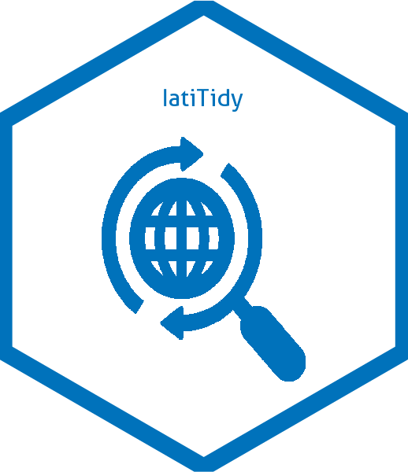
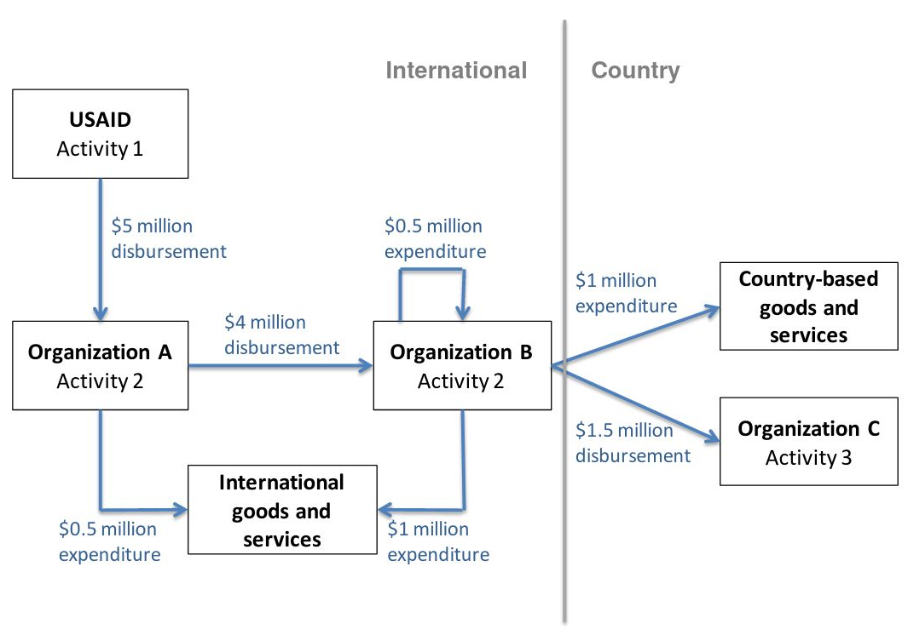

<!-- README.md is generated from README.Rmd. Please edit that file -->

```{r, echo = FALSE}
knitr::opts_chunk$set(
  collapse = TRUE,
  comment = "#>",
  fig.path = "README-"
)
```

# IatiTidy: An R Interface to International Aid Transparency Initiative Data Store 


This package wraps [IATI Datastore Query Builder](https://iatidatastore.iatistandard.org/querybuilder). For more info on the query builder, consult the dedicated [user guide](https://iatistandard.org/documents/10453/IATI_Datastore_Query_Builder_User_Guide.pdf). The IATI Datastore provides access to development and humanitarian data that complies with the most up-to-date rules of the [IATI Standard](https://iatistandard.org).

## What is IATI?

Launched in Accra in 2008, the International Aid Transparency Initiative (IATI) is a multi-stakeholder initiative and international open data standard that aims to improve the transparency and openness of both development and humanitarian activities. IATI provides a mechanism for the regular, automated publication of open data on financial flows and also enables organizations to publish information on their project or programming activities, including information on monitoring, evaluation and results. Overall, 1000+ [humanitarian and development organisations](https://www.iatiregistry.org/publisher/unhcr), including government donors, multilateral and UN agencies and international and local NGOs currently use the IATI Standard to publish information on who funds them, where the money goes and the impact or outcome of their activities. The use of IATI for Humanitarian actors is among the commitment from the grand bargain as presented in the  [dedicated portal](https://www.humportal.org/about).

The International Aid Transparency Initiative (IATI) data to trace aid flows from donor treasuries to their final end use. IATI is designed so that people can trace development spending flows through the development implementation chain, from one organization to other organizations, right down to the final stage in the chain: spending on goods and services.  __Traceability__ in IATI works by following the money as it flows from organization to organization through the development implementation chain. Provided that all organizations publish their information, it is possible to assess how much of the total funding at the beginning of the implementation chain is spent on goods and services, and where the money is spent. 

Data published to IATI is published in `activity` units, the core building blocks of the data. __Activities__ are usually projects, but they can be any unit of development cooperation as defined by the publisher, such as a program or a contract. Typically,an entire donor country program is made up of a number of activities. Each activity is given a unique identifier and contains details of all incoming and outgoing transactions. Each transaction also has a unique identifier and contains data covering,among other things,the date, the value, a description, and details about the provider and receivers of the funds. It is classified into one of three categories.

__Disbursement__: Outgoing funds placed at the disposal of a recipient government or organization, or funds transferred between two separately reported activities. Under IATI traceability standards the recipient of a disbursement should also be required to report their activities to IATI.

__Expenditure__: Outgoing funds spent directly on goods and services for the activity. The recipients of expenditures fall outside of IATI traceability standards and are considered to be the end of the implementation chain. Therefore, an expenditure provided to a non-country-based organization is considered to be funds `not reaching the country.

__Incoming fund__: Funds received for an activity, which can be from an external or internal source.

__Organisations__ can have different roles in IATI (each of them being segregated into different "Organisation Types"):
 * Reporting Organisations, i.e. organisations voluntarily reporting about their aid projects
 * Implementations organisations, that actually implements the activity.
 
 A summary of the potential flows, from the [2018 OXFAM report: Follow the Money](https://reliefweb.int/sites/reliefweb.int/files/resources/gt-follow-the-money-traceability-methodology-230218-en.pdf) is presented below:

 * __Overview of traceability in IATI__
 

 * __Details on How IATI Fields link across activities__
 

## Package Objectives

Rather than presenting the profile of a specific organization (as already do-able through numerous other tools) through a detailed query, the objective of this package is to extract data to perform __summary analysis__ as below:

 * What are the __most funded sectors__ per country?
 
 * What's the __share of ODA__ (Official Development Assistance) among the total flow of foreign aid per country?
 
 * What's the share of ODA going to __benefit of refugees__? (this can complement the measurement of [Global Refugee Compact Indicators related to ODA](https://www.unhcr.org/5cf907854.pdf#page=13))
 
 * What is the share of ODA allocated to __national actors__?
 
  * What's the __share of Humanitarian assistance__ within the total ODA?

 * Who are the __main donors by country__ in terms of number of projects and/or total budget?
 
 * What's the breakdown of __Earmarking Type__ (Unearmarked, Tightly earmarked, etc.) from Donor Funds by Year?

 * What's the relationship between when a project was __planned to start__ (proxy for when a project was conceived) and the amount of USD committed. We would know if there is a trend in terms of the project size?

 * What's the relationship between the amount of time by which start was __delayed__ and the amount of time by which the end of the project was delayed?


## Functionnality

The package goal is to conveniently:  

 * Pull data from the API by country(ies) and date
 
 * Tidy the results in a simple data frame by flattening lists within query results
 
 * Re-encode the data with labels from the [IATI code set](https://iatistandard.org/en/iati-standard/203/codelists/)
 
 * Generate predefined charts
 
The package is developed in the context of UNHCR Protection Monitoring activities in the Americas. A vignette is available to  display how it can be used. 
 
## Problems with the IATI data

There are issues with the published data. Several corrections have been made in the raw IATI data to get the current analysis. However there are still issues with the data, some of which will require manual intervention. A lis of specific issues in Humanitarian context is available [here](https://docs.google.com/spreadsheets/d/1_pPMscFcX259hwvi1lJ3GXog4XevpgT4uZHieJKoKWY/edit#gid=0)
 
## Installation

You can install `IatiTidy` from GitHub with:

```{r gh-installation, eval = FALSE}
# install.packages("devtools")
devtools::install_github("unhcr-americas/IatiTidy")
```

Users are welcome to flag bugs and or submit feature request [here](https://github.com/unhcr-americas/IatiTidy/issues/new)

#### Building package documentation 

`devtools::document()`

`devtools::check(document = FALSE)`

`pkgdown::build_site()` 
